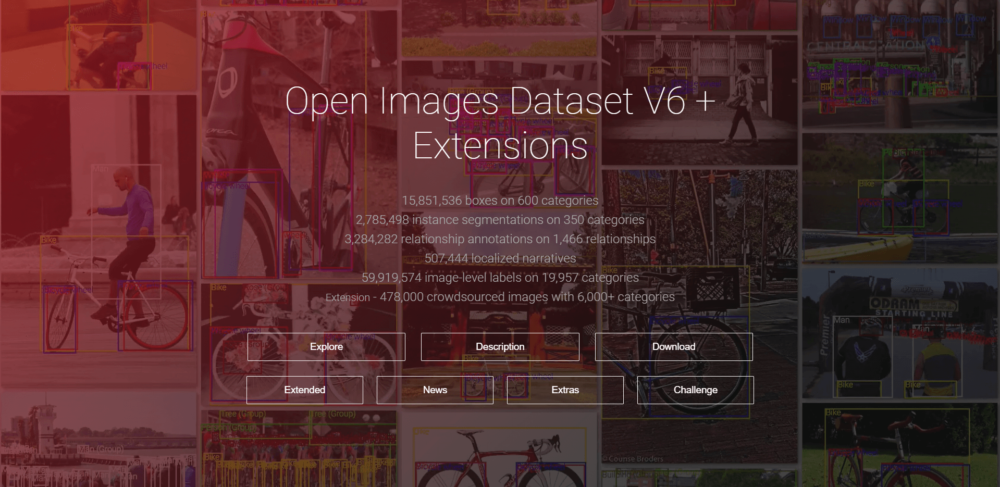

# Open-Images_EasyDownload
**Helper library for downloading OpenImages(https://storage.googleapis.com/openimages/web/index.html) categorically.**

Open Images is the largest annotated image dataset in many regards, for use in training the latest deep convolutional neural networks for computer vision tasks. But, sometimes large capacities of 'Open Images' make it difficult to find only the data you need.



**Then you can easily get data with this code including Bounding Boxes (600 classes), Object Segmentations, Visual Relationships, and Localized Narratives.**

## Settings
This code needs 'ratelim', 'tqdm' and 'checkpoint'. 'tqdm' and 'checkpoint' are included in this repository. But ***you need to install 'ratelim' using the code below.***
```
pip install ratelim
```

## Usage

```
usage: main.py [-h] [--category CATEGORY] [--type TYPE] [--ndata NDATA]
               [--label LABEL] [--annotation ANNOTATION] [--imageURL IMAGEURL]
               [--savepath SAVEPATH]
  
optional arguments:
  -h, --help            show this help message and exit
  --category CATEGORY   Enter the category you want. If you want multi-
                        category, please tag each category.
  --type TYPE           Enter the type of data you want. If you want 'Union
                        data' enter 'sum' else if you want 'intersection data'
                        enter 'inter'.
  --ndata NDATA         Number of data you want
  --label LABEL         Path of class descriptions file.
  --annotation ANNOTATION
                        Path of bbox annotation file.
  --imageURL IMAGEURL   Path of imageURL file.
  --savepath SAVEPATH   Path where downloaded data will be saved
```
### An example of usage is shown as follows. (*If you use this code at colab, add ! at the beginning.*)
```
python main.py --category "Football" --category "Person" --type "inter" --savepath "Football_data"
```
This example can get images that have **'Football category' and 'Person category' on each image.**

If you enter **"sum"** instead of "inter", you can get images that have **'Football category' or 'Person category' on each image.**

## etc...
Image is saved at "{--savepath}/images/[imageURL].jpg".

Information of bbox is saved at "{--savepath}/bbox/bbox.csv".

**You can use name of imagefile and column('OriginalURL') of 'bbox.csv' to match annotation to image.**

### If you want to download more faster, change parameters of ratelim in line 117.
```
*** Too many calls in a short time can lead to missing data. ***
@ratelim.patient(5, 5) # 5 times in 5 seconds (Gets called at most every 1. seconds)
@ratelim.patient(10, 5) # 10 times in 5 seconds (Gets called at most every 0.5 seconds)
```
